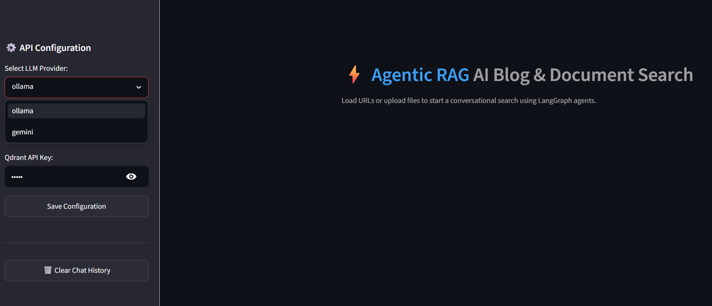
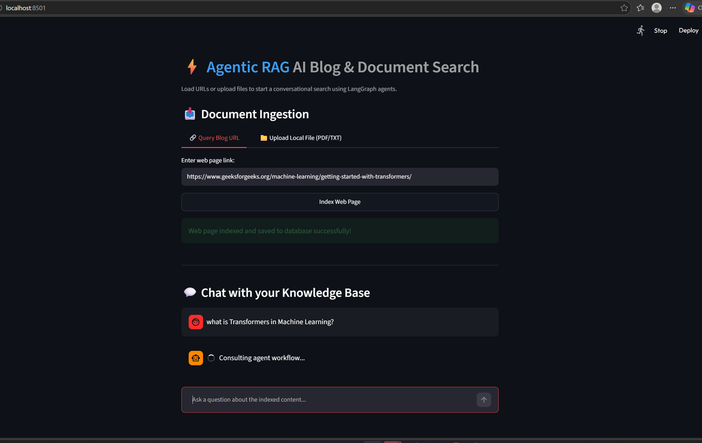
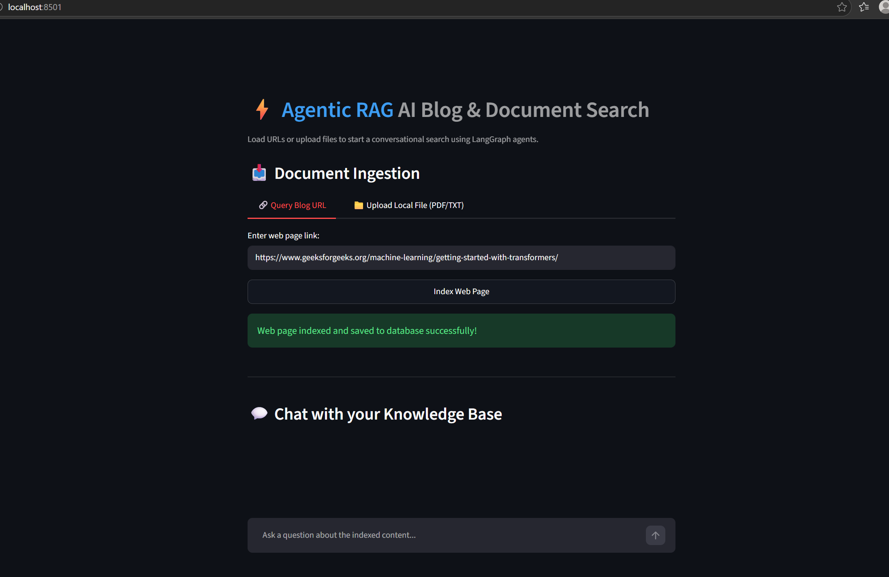
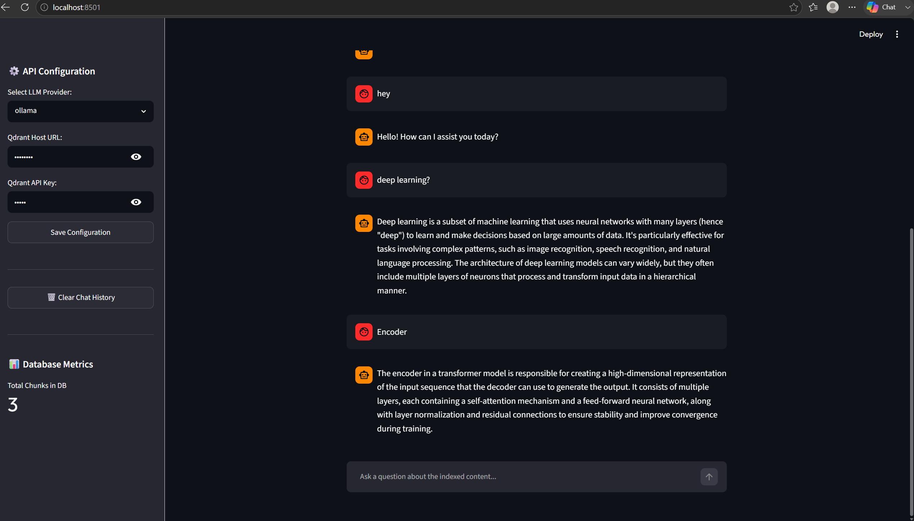

# 💬 AI Document & Blog Chat Agent

An intelligent, AI-powered chat assistant that lets you query web pages (URLs) or local documents (PDF, TXT) using **RAG (Retrieval-Augmented Generation)**. It runs on a structured **LangGraph** workflow and supports both cloud-based **Google Gemini** and 100% local **Ollama** models.

---

## 📸 Application Screenshots

### 1. Selecting Provider & Configuration


### 2. Setup Vector Database


### 3. Ingesting Web Page URL or Local File


### 4. Interactive Chatting with the Knowledge Base


---

## ✨ Features
* 🌐 **Web Ingestion:** Paste any article or blog post URL to scrape and index it instantly.
* 📄 **File Uploads:** Drag-and-drop local `.txt` or `.pdf` files to index them.
* 🤖 **Dual Provider Support:** 
  * **Local:** Ollama (defaulting to `qwen2.5-coder:7b` / `deepseek-r1:8b` and `nomic-embed-text`).
  * **Cloud:** Google Gemini (using `gemini-2.5-flash` and Gemini Embeddings).
* 📊 **Database Metrics:** Live sidebar counter tracking the number of document chunks currently in the database.
* 🧠 **Smart LangGraph Routing:** Auto-grades document relevance, rewrites queries for better lookup, and skips database search for casual conversational greetings.

---

## 🚀 Getting Started

### 1. Prerequisites
* **Python 3.10+** installed on your system.
* (Optional) **[Ollama](https://ollama.com/)** installed if running models locally.

### 2. Setup Virtual Environment & Install Dependencies
Open your terminal and run:

```bash
# Create a virtual environment
python -m venv .venv

# Activate it (Windows)
.venv\Scripts\Activate.ps1

# Activate it (macOS/Linux)
source .venv/bin/activate

# Install required packages
pip install -r requirements.txt
```

### 3. Pull Local Ollama Models (If using Ollama)
Make sure Ollama is running and run the following in your terminal:
```bash
# Pull the default embedding model
ollama pull nomic-embed-text

# Pull your preferred chat model (e.g. qwen2.5-coder:7b)
ollama pull qwen2.5-coder:7b
```

---

## 🏃 Running the Application

Start the Streamlit interface:
```bash
streamlit run app.py
```

---

## 📖 How to Use

1. **Select Provider:** Open the sidebar, and choose either **Ollama** (Local) or **Gemini** (Cloud).
   * *If Gemini:* Paste your Gemini API key.
2. **Setup Vector Database:** In the "Qdrant Host" field, type **`:memory:`** to run a local database inside your computer's RAM (no setup required!).
3. **Index Your Content:**
   * **URL Tab:** Paste an article link (e.g., a tutorial) and click **Index Web Page**.
   * **File Tab:** Upload a PDF or Text file and click **Index Local File**.
4. **Chat:** Once the "Total Chunks in DB" metric updates in the sidebar, ask questions in the chat box!
